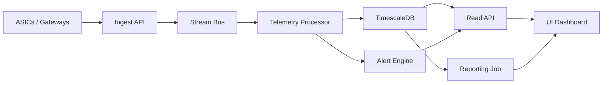

# D4 - Arquitectura Logica v1

## Objetivo de arquitectura
Habilitar ingesta confiable de telemetria, consulta rapida para operacion y trazabilidad de alertas, manteniendo simplicidad para iterar rapido.

## Componentes principales
- `Ingest API`: recibe telemetria de ASICs y gateways.
- `Stream Bus`: desacopla productores/consumidores de eventos.
- `Telemetry Processor`: normaliza, valida y enriquece eventos.
- `TimescaleDB`: almacenamiento principal de series temporales.
- `Alert Engine`: evalua reglas y emite alertas.
- `Read API`: expone datos para dashboard y reportes.
- `UI Dashboard`: vista operativa y seguimiento de alertas.
- `Reporting Job`: genera baseline diario de KPIs.

## Flujo logico
1. ASIC/gateway envia telemetria.
2. `Ingest API` valida contrato y publica evento.
3. `Telemetry Processor` persiste en `TimescaleDB`.
4. `Alert Engine` evalua reglas sobre ventana reciente.
5. `Read API` entrega datos a `UI Dashboard`.
6. `Reporting Job` consolida KPI diario.

## Diagrama

## Decisiones de diseno v1
- Arquitectura modular para separar ingesta, procesamiento y consulta.
- Event-driven simple para evitar acoplamiento fuerte.
- Base temporal especializada para consultas operativas.
- Reglas de alerta primero; ML queda para fases posteriores.

## Riesgos y mitigaciones
- Ruido de alertas: aplicar deduplicacion y ventanas de supresion.
- Carga de escritura alta: usar particion temporal e indices por clave operativa.
- Datos inconsistentes: validar esquema al ingreso y descartar payload invalido.
